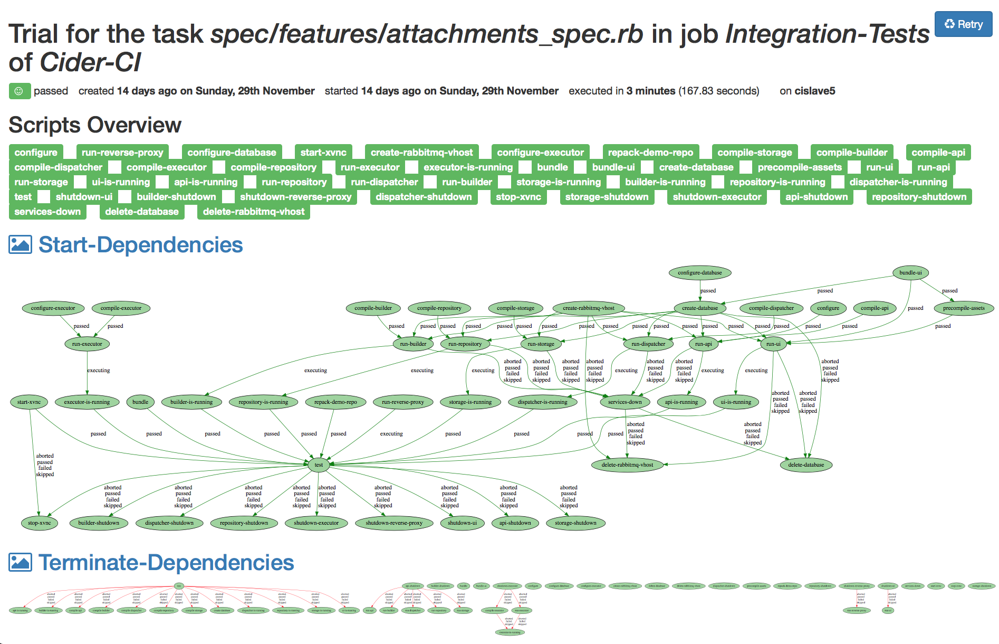

% Cider-CI multi-service integration tests
% eins78

## Cider-CI

Multi-service
integration tests

## Traditional CI:

**Continous *build*s**

single shell script

hooks *around* that script <small>(`before`, `after`, …)</small>  

**Problems:**

hard to make faster/parallelize

hard to set up/manage complex setups

## Cider-CI approach

- complex, but **explicit configuration**
- **declarative dependencies**
- very little assumptions about your workflow
- *pro:* hackability
- *con:* simples cases are relatively verbose

## Cider-CI overview

**Projects** have *1* **(git) Repo**

**Repo** contains configuration for *1+* **Jobs**

**Jobs** run *1+* **Tasks** *in parallel*

**Tasks** run *1+* (shell) **Scripts** *in order*

---

*Jobs* can be **triggered** from branches and **depend** on each other

*Tasks* can be re-tried

*Scripts* can **depend** on each other

## Details, quick walkthrough

(Excerpt from much longer Talk about Cider-CI)

- HTML: <http://drtom.ch/talks/2015/CL/>
- PDF: <http://drtom.ch/talks/2015/CL/slides.pdf>

## INSERT SLIDES HERE

## What is it good at?

**Speed:**

run lots of tasks **in parallel & retry** them

<small>*instead of* `sh tests/*`</small>

**Continous Integration/Delivery/…**

trigger and run different kinds of jobs

<small>*instead of* `sh tests/* && ./build && ./deploy`</small>

**Flexibility**

1 instance for your organization *or* 1 per project \
(re-)use existing infrastructure *or* "in the cloud"

## What does it not do?

**Access management**

always trusts the repository \
control (push) access there

**Secrets management**

set up your own infrastructure and/or excutors,

executors can be locked to "accepted repos"

<!-- If you dont trust your contributors, release/deploy from a special
repository and manage push access to it. -->

## Examples

- Jobs: "Test" *triggers* "Build" → "Release" → "Deploy-Docs"
- Job: **"Good To Merge"**, \
  *depends on* "Lint", "Unit Tests", "Feature Tests"

## <small>Complex example (CI-inception)</small>

## more features

- REST-ful **API** to implement any workflow you want
    - "nightly" builds and deploys
    - integrate with external services
- **attachments**
    - per *Trial*: for debugging (logs)
    - per *git-tree*: for **build artefacts** (binaries)
- good support for `git submodules`
- some github support: listen to update hook, set repo status

## Try it out

free software, installs with two commands <small>(ansible)</small>

`docs.cider-ci.info/` \
<small>or read the sources: `github.com/cider-ci/cider-ci`</small>

If you want to try something out here at the 32C3, \
contact me: `1@178.is`

**THX!**

