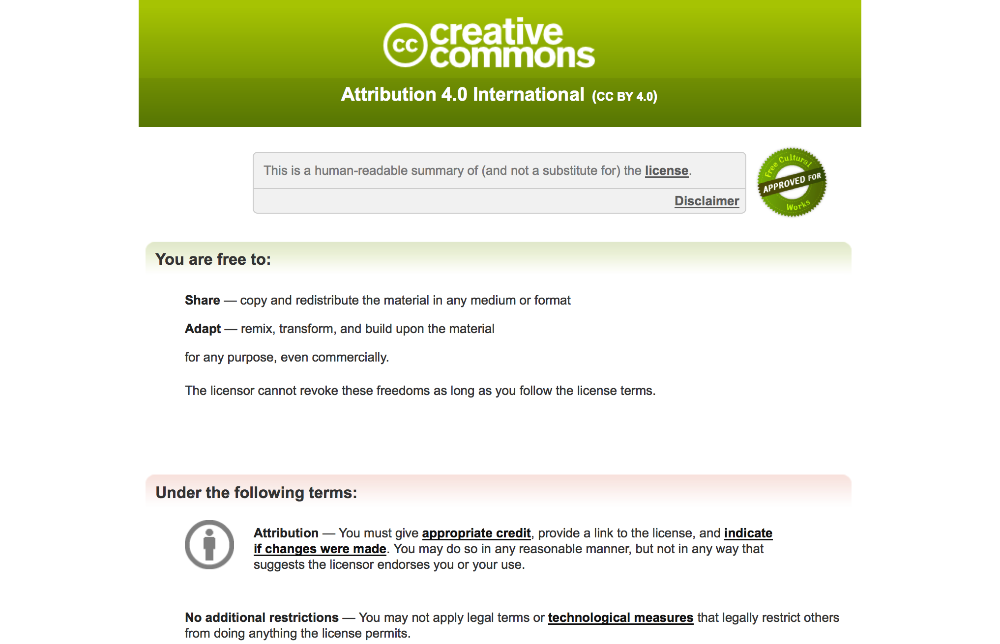
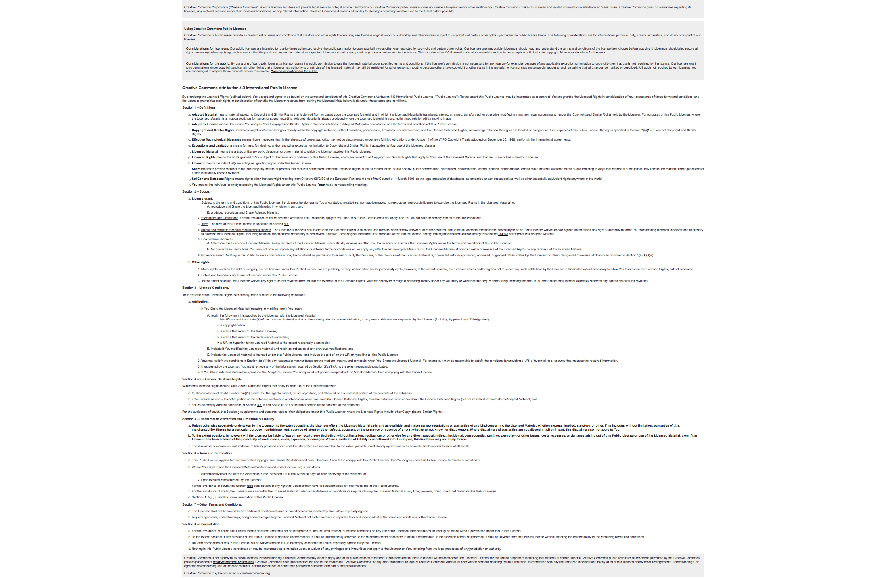
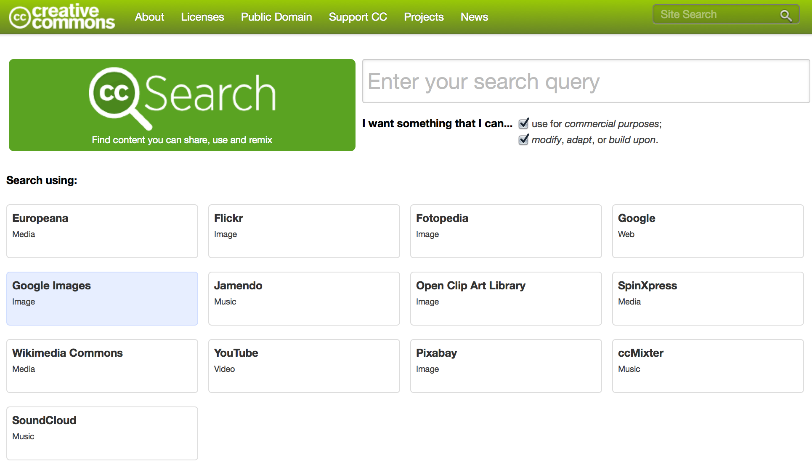

# **Copy*rights***, \
**Copy*wrongs*** und \
**Creative Commons**

#

## Worum geht es?

## Urheberrecht. Public Domain. Lizenz. Fair Use. Raubkopie. Open Source. Copyright. Privatkopie. CreativeCommons. 

# Worum geht es nicht?

Designrecht.
Patentrecht.
Ideenklau.
Filme herunterladen.

#

## Was ist das Urheberrecht?

**Das** Urheberrecht = \
Der Urheber bekommt \
**verschiedene Rechte** \
*an einem **Werk***

## **Urheber & Werk**

- Urheber: ein **Mensch**, der ein Werk geschaffen hat ("Autor")
- **Schöpfungshöhe**: Ist das Werk "besonders" genug?
    - bei Fotos ("Lichtbildern") eher niedrig
    - Texte, Musik, Filme, etc: erkennbarer Aufwand
    - lt. Gesetz: "Schöpfungen (…) die **individuellen Charakter** haben"
- **Ausnahmen**: Gesetze, Zahlungsmittel, "amtliches"

<aside class="notes">
erstaunlich, das Kochrezepte so frei verfügbar sind
</aside>

#

## Urheber-Recht*e*

- Persöhnlichkeitsrechte
- Verwertungsrechte

## Persöhnlichkeitsrechte

- Namensnennung
- Schutz vor Entstellung
- Schutz vor Zerstörung
- Besuchsrecht
- …

## **Nutzungsrechte**

- auch: **Verwertungsrechte**
    - Veröffentlichung
    - Veränderung
    - **Kopieren**/Verfielfältigung/Weitergabe \
      (aka: ***Copyright***)
    - …
- je nach Medium noch mehr
    - Film, Musik, Theater: **Aufführung**
    - Musik: Kopieren der Noten/Partitur

<aside class="notes">
Das aus den USA bekannte *Copyright* ist also nur eines von vielen *Urheber-Rechten*.
</aside>

#

## Nutzung fremder Werke

Um fremde Werke nutzen zu können, \
brauchen wir eine **"Erlaubnis"**.

- **Rechte der Öffentlichkeit**! \
  <small>("Schranken des Urheberrechts")</small>
- **Lizenz**

## "Schranken des Urheberrechts"

<small>[URG 5. Kapitel](http://www.admin.ch/opc/de/classified-compilation/19920251/index.html)</small>

- 70 Jahre nach Tot des Urhebers <small>(31. Dezember danach)</small>
- Zitatrecht
    - USA: *Fair Use*
- Eigengebrauch (CH)
- Abbildung v. Werken auf öffentlichem Grund(!)
- …

<aside class="notes">
- Wie können wir denn dann fremde Werke nutzen, wenn der URHEBER doch alle RECHTE hat?
- Auch die Öffentlichkeit hat Rechte!
</aside>

## **Lizenz**

Ein "Vertrag" zwischen Urheber und Dritten,
der bestimmte Nutzungen erlaubt.

- **WER** erlaubt **WEM**
- **WO**
- **WIE LANGE**
- **WAS** (Welche Nutzungen)
- Unter welchen **BEDINGUNGEN**
    - z.B.: Geld
- **EXKLUSIV** (oder nicht)

<aside class="notes">
Ein bekanntes Beispiel ist der Autor, der einem Verlag das Recht überträgt sein Buch zu drucken und dafür am Gewinn beteiligt wird. 
Solange keine Nutzung exklusiv übertragen wurde, können beliebig viele Lizenzen vergeben werden: 
So kann, später, ein anderer Verlag mit anderen Konditionen das Buch als Taschenbuch herausbringen.
</aside>

# 

## Warum ist das dann so kompliziert?

- Verschachtelte Rechte
- Kreuzung anderen Rechte (Persönlichkeitsrecht)
- Unklare Definitionen (wie lang darf ein Zitat sein)
- **Lizenzen skalieren schwierig**
- Ausnahmen, Ausnahmen, Ausnahmen

<aside class="notes">
Musik ist meistens mehr als sich ein selbst auf der Gitarre begleitende Singer/Songwriter, der sich auch noch selbst produziert hat, 
sondern dies sind alles eigenständige Berufe beziehungsweise URHEBER.

Im echten Leben ist es also schlecht möglich, das jeder einzelne DJ in einem Club oder Radiosender für jedes Lied jeden Beteiligten kontaktiert,
um Erlaubnis fragt und eine "angemessene Vergütung" vereinbart (wie im Gesetz gefordert).

- Beispiele für Ausnahmen & Details

  - ZHdK: Übertragung der Nutzungsrechte qua (Hochschul-)Gesetz
  - Graffiti: Anonyme Urheber, öffentl. Raum 
  - Soziale Netzwerke: Lizenz per TOS
  - keine Privatkopie für Software

</aside>

#

## Lösungen

Wie kann das skalieren?

- Zentralistisch: *Verwertungsgesellschaften*
- Dezentralistisch: *Free / Libre / Open Source*

## Verwertungsgesellschaften

- per Gesetz werden bestimmte Nutzungsrechte an bestimmten Medien
  den Verwertungsgesellschaften übertragen
- diese sind zentrale Verwalter, Vermittler und Lizengeber
- Bsp.: Band `<->` Radio

## Free / Libre / Open Source

- aus der Zeit der ersten Computer, vor PC
- viele Urheber, viele Nutzer, einfache Verteilgung (Internet)
- beschränkte Zeit auf Grossrechnern = Wunsch nach Effizienz
- Die ersten Software-Hacker wollten auch "Copyright" hacken
- Freie Lizenzen!
- "Free as in free speech, not as free beer"

<aside class="notes">
In den späten achtziger Jahren sahen sich US-amerikanische Programmierer und Nutzer von Software, vor allem an Universitäten vor ähnliche Probleme gestellt: 
Das vereinfachte Model von URHEBER, SCHUTZRECHTEN und LIZENZEN skaliert nicht auf eine große Zahl von Urhebern und Nutzern. 
Vor allem dann nicht, wenn man "seine" Software über das entstehende Internet mit anderen austauschen und optimieren wollte. 
Das war auch nötig, denn der "Persönliche Computer" war nur auf einem langsamen Vormarsch. 
So war die Zeit auf den universitären Grossrechnern beschränkt und wollte effizient genutzt werden. 
Die gleichen Menschen nannten sich auch *hacker* zu einer Zeit als der Begriff noch nicht zwischen Gut und Böse differenziert werden musste und so beschlossen sie,
das System *copyright* zu *hacken*. 
</aside>

## *4 Freedoms*

[4 grundlegende Freiheiten](http://fsfe.org/about/basics/freesoftware.html):

- Die Freiheit, ein Programm **auszuführen** <small>(vergleichbar mit dem Recht, Musik abzuspielen oder eine Schallplatter anzuhören).</small>
- Die Freiheit, ein Programm **weiterzugeben**.
- Die Freiheit, die Funktionsweise eines Programms herauszufinden und möglicherweise **anzupassen**.
- Die Freiheit, auch dieses **angepasste Programm weiterzugeben**.

## Beispiel: MIT-Lizenz

<small>`Copyright (c) <year> <copyright holders>`</small>

**Permission** is hereby granted, **free** of charge, to **any person** obtaining a copy
of this software and associated documentation files (the "Software"), to deal
in the Software without restriction, including without limitation the **rights
to use, copy, modify, merge, publish, distribute**, sublicense, and/or sell
copies of the Software, and to permit persons to whom the Software is
furnished to do so, subject to the **following conditions**:

The above copyright notice and **this permission** notice shall be **included in
all copies** or substantial portions of the Software.

#

##

## Creative Commons

Wenden diese Prinzipien auf *alle Medien* an!

- CC = Organisation, die Lizenzen erarbeitet
- CC = Sammelbegriff für diese Lizenzen
- CC = (auch) Sammelbegriff für CC-lizensierte Medien
- [Baukastenprinzip](http://creativecommons.org/choose/)

## Baukasten: Basis

- Werk darf frei weitergegeben werden
- Namensnennung Pflicht

## Baukasten: Auswahl

<small><http://creativecommons.org/choose/></small>

- "Erlauben, dass **Bearbeitungen** Ihres Werkes geteilt werden?"
    - Ja/Nein
    - Ja, solange andere **unter denselben Bedingungen weitergeben** 
- Möchten Sie **kommerzielle Nutzungen** Ihres Werkes erlauben?
    - Ja/Nein

## Lizenz-Versionen

- Menschenlesbar: Verständliche Zusammenfassung
- Anwaltslesbar: "Kleingedrucktes", eigentliche Lizenz
- Maschinenlesbar: Um Inhalte besser im Netz zu finden

##

##

## Suchen & Finden

<http://search.creativecommons.org/>

## <small>Bonus</small>

### **OpenCola**

[Im Ernst](https://en.wikipedia.org/wiki/OpenCola_%28drink%29)

### **Free Beer**

[Tatsache](https://en.wikipedia.org/wiki/Free_Beer)

