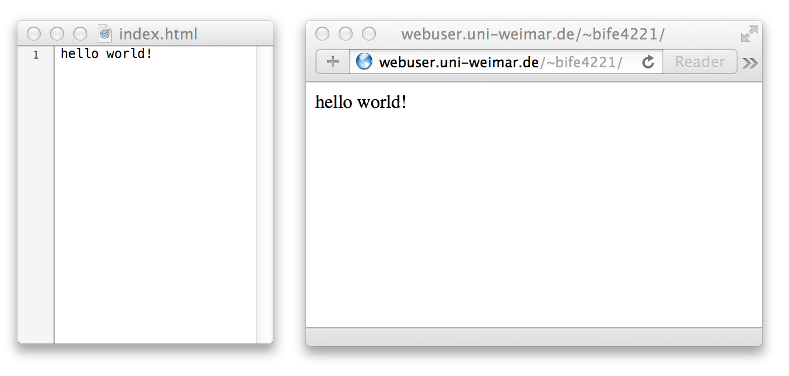

# Eine <small>(kurze)</small> Geschichte \
des Internetz

(**`Leertaste`** drücken um weiter zu springen)

# 

## **Protokoll**

- Absprache über die Umsetzung eines Prozess

## **Supermarkt-Protokoll** 

1. **`Kunde`** legt Ware auf Band
1. **`Personal`** scannt Ware
1. `Personal` nennt **`Preis`**
1. `Kunde` gibt: **`Geld`** (= größer/gleich `Preis`)
1. `Personal` gibt: **(`Geld-Preis`)** an `Kunde`

# 

## **Internet**

## Die Idee:

- ein dezentrales Netzwerk
- braucht keinen zentralen Computer/Server
- jeder Computer kann jeder anderen Computer erreichen (Daten austauschen)


# 

##1969--1990: **(D)ARPAnet **

DARPA: *Defense* Advanced Research Projects Agency

- Militär und Universitäten

##  


<!-- http://personalpages.manchester.ac.uk/staff/m.dodge/cybergeography/atlas/arpanet3.gif -->


## (D)ARPAnet: **Funktionen**

- Log-In in entfernte Rechner (Terminal -- telnet, heute SSH)
   - Kennt man aus Hackerfilmen (Matrix)
   - <small>(vor dem *Personal* Computer)</small>
   
## 

- File Sharing (Senden und Empfangen von Dateien)
    - **`FTP`**=File Transfer **Protocol**
    
## 

**Kommunikation**

 - E-Mail = elektronische Briefe
 - Usenet (vorläufer von Foren, Email-Listen)


## 1982: **`TCP/IP`**

`Transmission Control Protocol`/**`Internet`**` Protocol`  

- **Protokoll, wie Daten ausgetauscht werden**

## **`TCP/IP`**

 - **IP**: jeder Computer hat eine Internet Protocol (**IP**) address (141.54.1.34)
 - **TCP**: Daten werden in kleine Packete **zerteilt**, **addressiert** und solange von Knoten zu Knoten **weitergeschickt** ("gerouted") bis sie angekommen
 
<aside class="notes"> 
  TCP/IP ist nur die Grundlage, es gibt 500+ weitere Protokolle die darauf aufsetzen
</aside>

## 


<aside class="notes">
  Internet 1985
</aside>

## 

30% des Internets im Jahre 2005


# <!-- Pic: 30% des Internets im Jahre 2005 --> {data-background="http://upload.wikimedia.org/wikipedia/commons/d/d2/Internet_map_1024.jpg"}

<!--  -->

# **`DNS`**

**`Domain Name System`**

- "Adressbuch" des Internets
- `www.uni-weimar.de` = `141.54.1.34`


# 

## **Domains**

\ 

<pre>
                         <b>www.example.com</b>
                         ^   ^       ^
                         |   |       |
                         |   |       <b>Top-level</b> domain
                         |   <b>domain</b>
                         |
                         <b>sub</b>domain
         
</pre>


## **Top-Level**

\ 

Oberste Kontrollstelle

\ 

- **Kontrolle**
- `.com`, `.org`, `.net`, `.us`, … -> USA
- `.de`, `.fr`, `.se`, `.is` -> Div. Länder

# 1990: **Internet für Alle!**

- jeder darf die Protokolle benutzen (nicht neu)
- alle dürfen in **DAS** Internet 

<aside class="notes">
  (das ist der springende Punkt, sonst gäbe es nicht "das" Internet)
</aside>

# 

## 1991: **`WWW`**

- Tim Berners-Lee erfindet das ***World Wide Web***
- In Ermangelung einer Website [postet er die Idee ins **`Usenet`**](http://groups.google.com/group/alt.hypertext/msg/395f282a67a1916c?dmode=source)


## Usenet Post:

````
Path: gmdzi!unido!mcsun!cernvax!info
From: timbl@info .cern.ch (Tim Berners-Lee)
Newsgroups: alt.hypertext
Subject: WorldWideWeb: Summary
Keywords: heterogeneous hypertext, web, source, protocol, 
  index, information retrieval
Message-ID: <6487@cernvax.cern.ch>
Date: 6 Aug 91 16:00:12 GMT
References: <6484@cernvax.cern.ch>
Sender: n...@cernvax.cern.ch
Lines: 84
````

## 

````
In article <6...@cernvax.cern.ch> I promised to post a short summary  of the  
WorldWideWeb project.  Mail me with any queries.

		WorldWideWeb - Executive Summary


The WWW project merges the techniques of information retrieval and hypertext to  
make an easy but powerful global information system.

The project started with the philosophy that much academic information should  
be freely available to anyone. It aims to allow information sharing within  
internationally dispersed teams, and the dissemination of information by  
support groups.
````

## 

````
     Reader view

The WWW world consists of documents, and links.  Indexes are special documents  
which, rather than being read, may be searched. The result of such a search is  
another ("virtual") document containing links to the documents found.  A simple  
protocol ("HTTP") is used to allow a browser program to request a keyword  
search by a remote information server. 

The web contains documents in many formats. Those documents which are  
hypertext,  (real or virtual) contain links to other documents, or places  
within documents. All documents, whether real, virtual or indexes, look similar  
to the reader and are contained within the same addressing scheme.

To follow a link,  a reader clicks with a mouse (or types in a number if he or  
she has no mouse). To search and index, a reader gives keywords (or other  
search criteria). These are the only operations  necessary to access the entire  
world of data.
````

## WWW: Die 3 Ideen
 1. Alles ist formatierter *Text*
 2. _Links_ führen von einem Dokument zum nächsten (HyperText)
 3. *Index*: Liste von Dokumenten in einem Ordner

## d.h.:
 - Jeder kann von seinem Schreibtisch empfangen und senden 
 - Der erste Web-**Server**  


<aside class="notes">
  (! -- Brecht! Medientheorie!)
</aside>

# 

## **Save Point** {data-background="#b6ff7a"}

1. Mit dem **Internet-Protokoll** \
   werden **Daten-Packete** hin- und hergeschickt. \
   Alle Computer in allen verbundenen Netzen \
   formen das **Internet**.
2. Mit dem **HyperText-Transfer-Protokoll** \
   können *über das Internet* **Dateien** ausgetauscht werden \
   ("herunterladen").
3. **`HTML`-Dokumente** \
   sind Text-Dateien mit "Extras" und **Links**. \
   Diese Verbindungen zwischen den Dokumenten formen das **"Web"**. \
   Ein **`Browser`** lädt die Dokumente, **stellt sie dar** \
   und **navigiert** zu Links.


## 

<https://www.youtube.com/watch?v=8PNRrOGJqUI>

#

## Web applications

- 1996: Paul Graham denkt nochmal über diese **Links** nach.
- Auf dem **Server** ist **Software**, die **Dokumente ausliefert**.
    - <small>`http://example.com/hello.html` 
      — *"gib mir das Dokument hello"*</small>
- Der Software ist es **egal**, was in dem Link steht…
- <small>`http://example.com/give-me-a-beer.plz` 
  — *"gib mir ein Bier?"*</small>
- … also kann mit Software **alles** als Webseite gebaut werden. 


# 

## Die Netz-Probleme

- a.k.a. \
  


## 
 
 

<small>"Every time you email a file to yourself \
  so you can pull it up on your friend's laptop, \
  Tim Berners-Lee sheds a single tear."</small>


## Problem #1. Asymmetrische Verbindungen  

- DSL=**A**DSL
 - der Geburtsfehler des (privaten) Internets
- Beispiel: DSL16000 = 16 Mbps (=~30€)
 - Herunteladen: 13,06 Mbps; Up: 0,96 Mbps
 - = 1,63 MB/s down und 0,12MB/s up
 - also: 1GB **herunterladen**: 10min; 1GB **hochladen**: 2h 20min
 - noch schlimmer: 1GB an 10 Leute schicken (~1,5h vs. ~1 Tag)


## Problem #2. Knapper Addressraum

- es gibt (schon lange) nicht mehr genug IP-Adressen für alle (1.1.1.1--255.255.255.254 = 4.3 Milliarden ), also:
- **Dynamische IPs**: jeder Kunde bekommt bei jeder neuen Verbindung *irgendeine* freie Adresse zugewiesen
- **NAT**: Ein Kunde = 1 Anschluss = 1 Wohnung = 1 Addresse für X Geräte
  - 5 Leute teilen sich eine Telefonnummer
  - Das funktioniert gut, wenn ich etwas aus dem Netz will (ich hebe ab und wähle eine Nummer -> Telefonat)
  - Funktioniert schlecht, wenn jemand aus dem Netz etwas von mir will (das Telefon klingelt -> "Hi, ist Max da?")


## Was heisst das?

- Alice und Bob sitzen beide in ihrer Wohnung (hinter einem DSL-Anschluss)
- Beide wollen eine Datenverbindung aufbauen
- Also müssen beide ihre eigene, aktuelle IP-Adresse herausfinden und sich mitteilen.
- Wie? Brieftaube?
- Dann müssen beide noch ihren Router richtig konfiguriert haben…
- Und selbst dann ist alles sehr langsam


## (Long-term solutions)

- **IPv6**
  - 3.4×10^38 Adressen =  340.000.000.000.000.000.000.000.000.000.000.000.000 = 340 undecillion = [340 billion billion billion billion](http://www.wolframalpha.com/input/?i=340000000000000000000000000000000000000)
  - standard since 1998(!)


# 

## Die Absurde Situation

- wir haben ein weltumspannendes, dezentrales Netzwerk
- um es zu benutzen, brauchen wir (Privatleute) zentrale Dienste
- 

## Beispiele

- GMail/Web.de & Co. *statt* einem eigenem Email-Server
  - (Fun Fact: Osama Bin Laden war bei Yahoo!Mail)
- Facebook, Flickr, Soundcloud, Blogspot, etc *statt* eigenem WWW-Server
- Skype *statt* VoIP/SIP/Jabber
- ~~Kino.to~~/kinox.to<small>(?)</small>/Dropbox/etc *statt* `ftp://max.server/Filme/Film.avi`
- Rapidshare/Mega~~Upload~~/etc *statt* BitTorrent

---


# 

## **Hausaufgabe**

## **`hello world`**

- **Stelle eine Web-Seite online**

##



## **`hello world`**

**Stelle eine Web-Seite online**

- Textdatei: **`index.html`**
    - <small>**Nicht**: Word-, Office, etc, -Datei</small>
- **Mindest-Inhalt**: "`hello world`"

## 

Textdatei: **`index.html`**

- **Nicht**: Word-, Office, etc, -Datei
    - Windows: `Notepad.exe`
    - Mac: `TextEdit.app`
    - Linux: `GEdit`, `Leafpad`, …

# 

## Wie? <small>(Ohne Geld zu bezahlen…)</small>

1. **Uni-Webspace** \
    <http://bit.ly/uniwebspace> \
    <small><http://www.uni-weimar.de/cms/universitaet/zentrale-einrichtungen/servicezentrum-fuer-computersysteme-und-kommunikation/service/www-seiten.html></small>
    **Bsp**: <http://webuser.uni-weimar.de/~bife4221/>
2. **Github Pages** \
    <http://pages.github.com>
3. **`DIY`** <small>eigener Server?</small> \
    **muss von Uni aus bearbeitbar sein…** \

\ 

Bei Fragen: `ktl@178.is` \
Folien etc: **`http://bit.ly/ktlwiki`** \
<small><http://www.uni-weimar.de/medien/wiki/FK:Kunst-Technik-Labor></small> \

<aside class="notes">
  am montag gibts auch detailierte anleitungen auf dem wiki!
</aside>


<style>
/* icons from font awesome */
@import url(http://fonts.googleapis.com/css?family=Source+Sans+Pro:400,600,400italic,600italic|Source+Code+Pro:400,600,500|Grand+Hotel);
@import url(http://netdna.bootstrapcdn.com/font-awesome/4.0.3/css/font-awesome.css);
.reveal i.fa {
  font-style: normal;
  font-family: FontAwesome;
}
.reveal i.fa-3x {
  font-size: 3em;
} 
/* for overriding 'simple' theme */
.reveal {
  font-size: 2.5em;
  font-family: "Source Sans Pro", sans-serif;
  font-weight: 600;
  color: #444;
}
b, strong {
  font-weight: 700;
}
.reveal h1,
.reveal h2,
.reveal h3,
.reveal h4,
.reveal h5,
.reveal h6 {
  letter-spacing: inherit;
  text-transform: inherit;
  font-family: inherit;
  font-weight: inherit;
  
  color: #444;
}
.reveal pre, .reveal code {
	font-family: "Source Code Pro", monospace;
  font-weight: 500;
  box-shadow: none;
}
.reveal strong code {
  font-weight: 700;
}
.reveal pre.small {
  font-size: 0.5em;
}
.reveal ul, .reveal ul ul {
  list-style-type: none;
  text-align: inherit;
  margin: 0;
}
.reveal ol li {
  list-style-type: none;
  counter-increment: list;
  margin-left: 1em;
}
.reveal ul li::before, ol li::before {
  content: "→ ";
  color: #888;
  font-weight: 700;
  margin-left: -1em;
}
.reveal ol li::before {
  content: counter(list) ". ";
}
.reveal ul ul li::before {
  content: "◉ ";
}
.cursive, code.cursive {
  font-family: 'Grand Hotel', cursive;
  letter-spacing: 0;
}
.reveal small {
  vertical-align: baseline;
}
.reveal section img {
  border: none;
  box-shadow: none;
}
.reveal .controls div.navigate-left,
.reveal .controls div.navigate-left.enabled {
  border-right-color: hsl(200, 100%, 25%); }

.reveal .controls div.navigate-right,
.reveal .controls div.navigate-right.enabled {
  border-left-color: hsl(200, 100%, 25%); }

.reveal .controls div.navigate-up,
.reveal .controls div.navigate-up.enabled {
  border-bottom-color: hsl(200, 100%, 25%); }

.reveal .controls div.navigate-down,
.reveal .controls div.navigate-down.enabled {
  border-top-color: hsl(200, 100%, 25%); }

.reveal .controls div.navigate-left.enabled:hover {
  border-right-color: hsl(200, 100%, 40%); }

.reveal .controls div.navigate-right.enabled:hover {
  border-left-color: hsl(200, 100%, 40%); }

.reveal .controls div.navigate-up.enabled:hover {
  border-bottom-color: hsl(200, 100%, 40%); }

.reveal .controls div.navigate-down.enabled:hover {
  border-top-color: hsl(200, 100%, 40%); }

.reveal .progress {
  height: 0.8%;
  background: hsl(200, 100%, 25%);
}
.reveal .progress span {
  background: #fff;
}
</style>