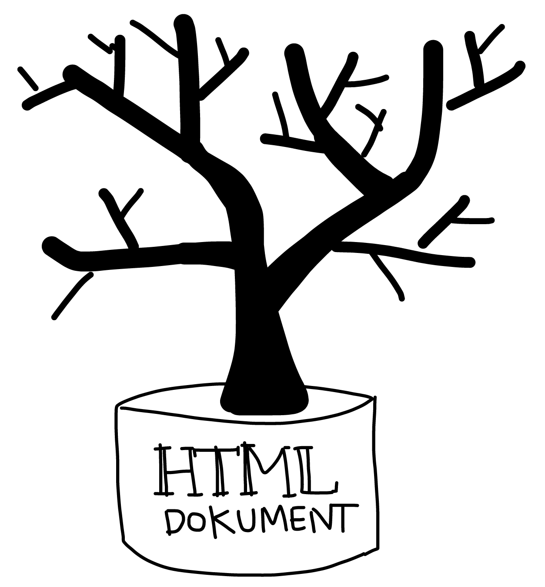
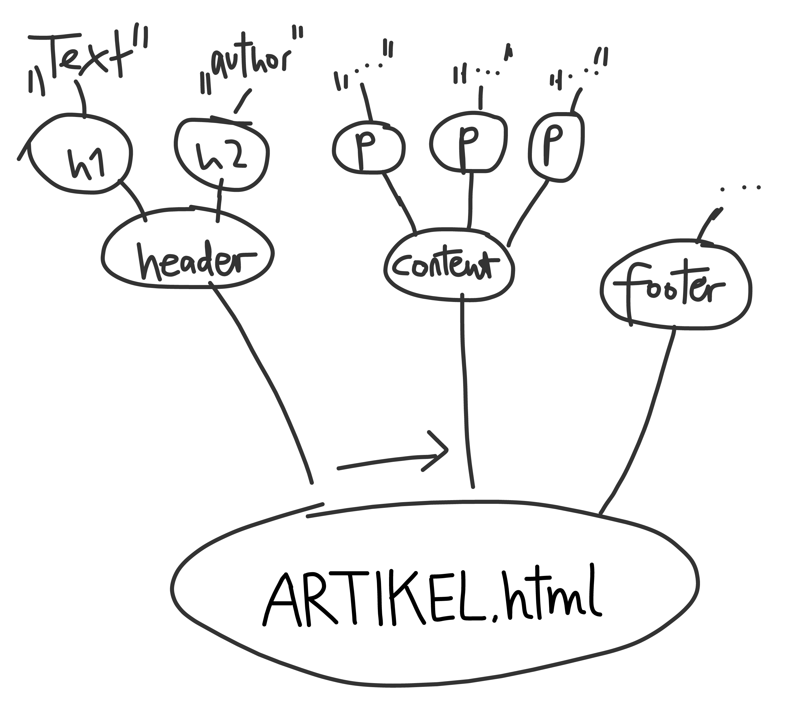
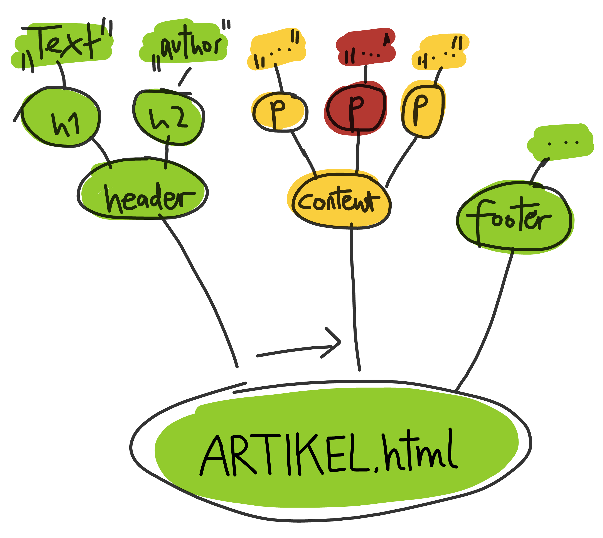

# 

## <small>Previously…</small>

##{data-background="images/internet-web-1.png" data-background-transition="fade"}

 

##{data-background="images/internet-web-2.png" data-background-transition="fade"}

 

##{data-background="images/internet-web-3.png" data-background-transition="fade"}

 

##{data-background="images/internet-web-4.png" data-background-transition="fade"}

 

# 

## <small>**Programmieren**</small>

\ 

- ***"Ein Programm schreiben"***


## <small>**Programmieren**</small>


\ 

- Ein **Computerprogramm** ist eine \
  **Folge von Anweisungen**
  <small>(in einer Programmiersprache),</small> \
  um *auf einem Computer*
  eine bestimmte \
  **Problemstellung lösen zu können.**  <small>([wiki](https://de.wikipedia.org/wiki/Computerprogramm))</small>
    - *Beispiele:* **Browser**, Photoshop, Texteditor
- *Einfacher:* \
**"Dem Computer sagen was er tun soll!"**
    - *Beispiel:* **`HTML`** `:)`


## **`C0DE`**

- **CODE = Kodierung** (allgemein)
- **Source Code = Quelltext** (z.B. eines Programms)
- **Quelltext wird vom Computer interpretiert!**
    - nach bestimmten (meist engen) Regeln
    - ein Programm wird **ausgeführt**
    
## <!-- Interpretation -->

\ 

Es gibt einen \
**Unterschied zwischen Quelltext und Ergebnis!**

\ 

- Der *Quelltext* enthält **Anweisungen**, \
  die ausgeführt werden.


## <!-- Umgebung -->

- Die *Anweisungen* werden in \
einer **Umgebung** ausgeführt.

- Diese Umgebungen sind **verschachtelt**.

- Computer
- Betriebssystem
- "Programme" (z.B. Browser)
- "Skripte" (Code läuft in einem "Programm")
- <small>(virtuelle Maschinen, …)</small>

#

## 

\ 

1 Prozessor und 13 Steckdosen

\ 

- kleiner, kleiner **Computer**
- sehr kleines, simples **Betriebssytem**
    - Führt 1 Programm aus <small>(kleiner Speicher)</small>
    - Verbindungen zur Aussenwelt \
      (**Strom**: IN/OUT, AN/AUS/Spannung)
- **1 Programm** (im Loop)
    - z.B. "Wenn Input=An, mache Output=an" (Lichtschalter)


## 


````small
/* stolen from http://www.arduino.cc/en/Tutorial/Button */

// set pin numbers:
const int buttonPin = 2;     // the number of the pushbutton pin
const int ledPin =  13;      // the number of the LED pin

int buttonState = 0;         // variable for reading the pushbutton status

void setup() {
  // initialize the LED pin as an output:
  pinMode(ledPin, OUTPUT);      
  // initialize the pushbutton pin as an input:
  pinMode(buttonPin, INPUT);     
}

void loop(){
  // read the state of the pushbutton value:
  buttonState = digitalRead(buttonPin);

  // check if the pushbutton is pressed.
  // if it is, the buttonState is HIGH:
  if (buttonState == HIGH) {     
    // turn LED on:    
    digitalWrite(ledPin, HIGH);  
  } 
  else {
    // turn LED off:
    digitalWrite(ledPin, LOW); 
  }
}
````

## 


<pre>
void <b>loop</b>(){
  // read the state of the pushbutton value:
  buttonState = digitalRead(buttonPin);

  // check if the pushbutton is pressed.
  // if it is, the buttonState is HIGH:
<mark>  <b>if (buttonState == HIGH) {    </b>
    // turn LED on:             
    <b>digitalWrite(ledPin, HIGH); 
  }</b>                             
  <b>else {</b>                        
    // turn LED off:            
    <b>digitalWrite(ledPin, LOW);  
  }                             </b></mark>
}
</pre>


## Zum Beispiel: \
**PC + Webseite**

- relativ großer **Computer**
    - mit bestimmter **Peripherie**
    <small>(Bildschirm, Tastatur, Maus, Sound, …)</small>
- ziemlich großes **Betriebssystem**
    - Hardware (Speicher, Netzwerk, …)
    - Grafische Oberfläche, Benutzerkonten, <small>(Rechte, …)</small>
    - **Programme**, u.v.m.…
- Programm: **Browser**
- **`HTML`-Website** 


# 

## **`HTML`**


- `HTML`: sehr einfache **Programmiersprache**
- **läuft im Browser**
    - Der Browser ist die *Umgebung*


## `HTML`: **Dokument**

1. **Datei** (plain text)<small>, mit Inhalt:</small>
2. **Text** (zum lesen)
3. **Tags** (zum strukturieren)


## `HTML`: **Tags**

- **`<html>`**
- **`<body>`**
- **`<h1>`** <small>(**H**eading **1.** Ordnung)</small>
  
#
  
## `HTML`: **Baum**




## `HTML`: **Baum**

\ 

<pre>
                      <b>&lt;h1&gt;</b>
                        hello world
                      <b>&lt;/h1&gt;</b>
</pre>


## `HTML`: **Baum**

\ 

<pre>
                        <b>&lt;html&gt;</b>
                          &lt;body&gt;
                            &lt;h1&gt;
                              hello world
                            &lt;/h1&gt;
                          &lt;/body&gt;
                        <b>&lt;/html&gt;</b>
</pre>

## `HTML`: **Baum**

\ 

<pre>
                        &lt;!doctype html&gt;
                        <b>&lt;html&gt;</b>
                          &lt;body&gt;
                            &lt;h1&gt;
                              hello world
                            &lt;/h1&gt;
                          &lt;/body&gt;
                        <b>&lt;/html&gt;</b>
</pre>


## <small>`HTML`: **Baum**</small>


## <small>`HTML`: **Baum**</small>



## `HTML`: mehr **Tags**

- `<head>`, **`<body>`**
- **`<h1>`**, `<h2>`, `…`, `<h6>`
- **`<p>`**, `<ul>`, `<ol>`, `<li>`, …
- **`<strong>`**, `<em>`, `<small>`, …
- **``**, `<form>`, …
- **`<div>`**, `<header>`, `<footer>`, …


## 

<pre>
          &lt;html&gt;
            &lt;body&gt;
              &lt;h1&gt;
                Hello World!
              &lt;/h1&gt;
<mark>              <b>&lt;p&gt;                      
                Ein Absatz voll Text.  
              &lt;/p&gt;</b>                     </mark>
            &lt;/body&gt;
          &lt;/html&gt;
</pre>

## 

<pre>
          &lt;html&gt;
            &lt;body&gt;
              &lt;h1&gt;
                Hello World!
              &lt;/h1&gt;
              &lt;p&gt;
                Ein Absatz voll Text.
              &lt;/p&gt;
<mark>              <b>&lt;ul&gt;</b>                          
                Eine Liste                  
                <b>&lt;li&gt;</b>                        
                  Ein Listenpunkt           
                <b>&lt;/li&gt;</b>                       
                &lt;li&gt;                        
                  Ein weiterer Listenpunkt  
                &lt;/li&gt;                       
              <b>&lt;/ul&gt;</b>                         </mark>
            &lt;/body&gt;
          &lt;/html&gt;
</pre>

#

## **Styling**: `CSS`

- `CSS` = Cascading Style Sheet
- kaskadieren = den Ästen am Baum folgen

##




##

<pre>
          &lt;style&gt;
          <b>body</b> {
            background-color: lightgreen;
          }
          <b>ul</b> {
            background-color: lightsalmon;
          }
          <b>ul li</b> {
            background-color: yellow;
          }
          &lt;/style&gt;
</pre>


#

## **Dynamik**

2 grundlegend verschiedene Methoden um 'dynamische Webseiten' zu erstellen <small>(Schliessen sich nicht aus!)</small>

## Dynamik

- Seiten **generieren** (**SERVER**) (`CMS`, `PHP`, `mustache`, templates, etc)
    - `<h1>`**`<?php echo "Hello World!"; ?>`**`</h1>`

- Javascript (**BROWSER**)
    - `<title></title>` \
      **`<script>`** \
        **`document.title = "Hello World!"`** \
        **`</script>`**


## Daten-**Portabilität**{#port}

- statische Webseiten können beliebig auf Server verschiedener Hoster kopiert werden
- nur relevant bei eigener **Domain**!
- Dynamische, Server-Webseiten: \
kommt auf die Software an (<small>`Wordpress.com/.org`</small>)

<style type="text/css" media="screen">
/* icons from font awesome */
@import url(http://fonts.googleapis.com/css?family=Source+Sans+Pro:400,600,400italic,600italic|Source+Code+Pro:400,600,500|Grand+Hotel);
@import url(http://netdna.bootstrapcdn.com/font-awesome/4.0.3/css/font-awesome.css);
.reveal i.fa {
  font-style: normal;
  font-family: FontAwesome;
}
.reveal i.fa-3x {
  font-size: 3em;
} 
/* for overriding 'simple' theme */
.reveal {
  font-size: 3em;
  font-family: "Source Sans Pro", sans-serif;
  font-weight: 600;
  color: #444;
}
b, strong {
  font-weight: 700;
}
.reveal h1,
.reveal h2,
.reveal h3,
.reveal h4,
.reveal h5,
.reveal h6 {
  letter-spacing: inherit;
  text-transform: inherit;
  font-family: inherit;
  font-weight: inherit;
  
  color: #444;
}
.reveal pre, .reveal code {
	font-family: "Source Code Pro", monospace;
  font-weight: 500;
  box-shadow: none;
}
.reveal strong code {
  font-weight: 700;
}
.reveal pre.small {
  font-size: 0.5em;
}
.reveal ul, .reveal ul ul {
  list-style-type: none;
  text-align: inherit;
  margin: 0;
}
.reveal ul li {
  padding-bottom: 0.5em;
}
.reveal ul li ul li {
  font-size: 0.8em;
  padding-bottom: 0;
}
.reveal ol li {
  list-style-type: none;
  counter-increment: list;
  margin-left: 1em;
}
.reveal ul li::before, ol li::before {
  content: "→ ";
  color: #888;
  font-weight: 700;
  margin-left: -1em;
}
.reveal ol li::before {
  content: counter(list) ". ";
}
.reveal ul ul li::before {
  content: "◉ ";
}
.cursive, code.cursive {
  font-family: 'Grand Hotel', cursive;
  letter-spacing: 0;
}
.reveal small {
  vertical-align: baseline;
}
.reveal section img {
  border: none;
  box-shadow: none;
}
.reveal .controls div.navigate-left,
.reveal .controls div.navigate-left.enabled {
  border-right-color: hsl(200, 100%, 25%); }

.reveal .controls div.navigate-right,
.reveal .controls div.navigate-right.enabled {
  border-left-color: hsl(200, 100%, 25%); }

.reveal .controls div.navigate-up,
.reveal .controls div.navigate-up.enabled {
  border-bottom-color: hsl(200, 100%, 25%); }

.reveal .controls div.navigate-down,
.reveal .controls div.navigate-down.enabled {
  border-top-color: hsl(200, 100%, 25%); }

.reveal .controls div.navigate-left.enabled:hover {
  border-right-color: hsl(200, 100%, 40%); }

.reveal .controls div.navigate-right.enabled:hover {
  border-left-color: hsl(200, 100%, 40%); }

.reveal .controls div.navigate-up.enabled:hover {
  border-bottom-color: hsl(200, 100%, 40%); }

.reveal .controls div.navigate-down.enabled:hover {
  border-top-color: hsl(200, 100%, 40%); }

.reveal .progress {
  height: 0.8%;
  background: hsl(200, 100%, 25%);
}
.reveal .progress span {
  background: #fff;
}
</style>